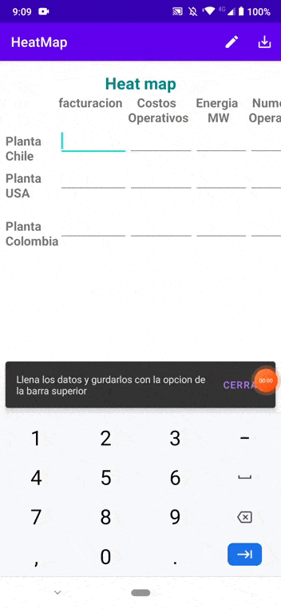
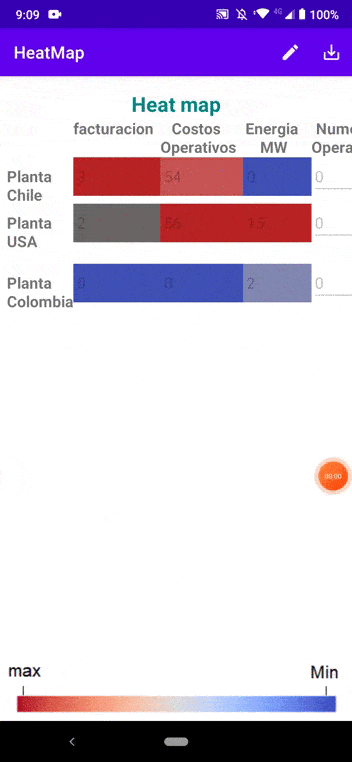

# HeatMap

Esta es una aplicación que permite crear un mapa de calor apartir de unos datos de entrada

## Tecnologia aplicada

MVVM: arquitectura.  
Room: Base de datos local.  
Corutines: corutinas para manejar ejecucion de codigo asincrono. 
DataBinding: Union entre componentes layout y controladores.  
DataBinding two way: Permite programacion reactivia a cambios en la entra.  
SharePreferences: Almacena datos de poco tamaño que persisten en la aplicacion.  

## Aplicación

En un comienzo se pueden llenar los datos y de forma reactiva se activaran los colores representativos, una vez lleno se selecciona guardar en la barra superior.

Para editar los datos se selecciona la opcion de la barra, update, que permite habilitar la edicion de datos y una vez editados se vuelven a guardar

## License

Application developed by Miguel Angel Bello Garcia, github @miguelmabellog
